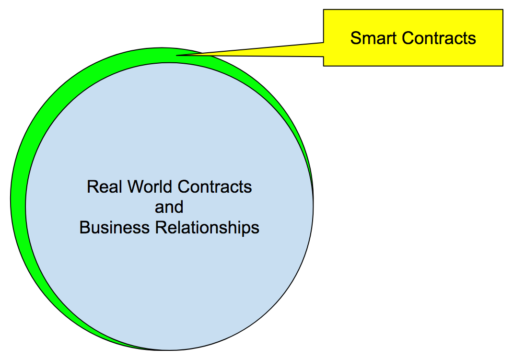

# Scarsdale: A Smart Contract Synopsis Language (SCSL)

This document captures the design of Scarsdale, which is a [YAML](http://yaml.org/)-based language for summarizing the key facets of Smart Contracts (SC) and Real World Contracts (RWC).  As you can see in the Venn diagram below, **Scarsdale models Real World Contracts as a proper subset of Smart Contracts**.



As of this writing, the SC world is miniscule compared to the diversity and scale of the RWC.  We think that this will change over time, as SCs become more useful.  **We created Scarsdale because people need to be able to compare RWCs with SCs.**

Scarsdale can be used to model everything from simple RWCs to complex SCs running on the Blockchain.  We can make this claim because Scarsdale does not seek to capture everything.  Scarsdale is not about perfection: it is about sufficiency.  **Scarsdale is designed to capture a sufficient amount of detail related to the who, what, where, when, why, and how of a broad range of contracts**.  Scarsdale's power lies in its breadth of coverage and its ease of use.

## Project Status

This project is in Alpha status.

## Terminology

We use the word contract in its most general sense.  The term RWC includes contracts such as 'buy a pizza' or 'buy a house'.  We include RWC within the definition of SC because **SCs must span both worlds** in order to be useful to people [In Real Life](http://www.dictionary.com/browse/irl).  The term SC includes RWC plus things like on-blockchain-execution, cryptographic primitives, privacy assertions, indirection, quorums, and thousands of supporting services that have yet to be invented.

This project is named Scarsdale because Scarsdale is easier to pronounce than SCSL.  Scarsdale also happens to be the name of [a town in New York](https://en.wikipedia.org/wiki/Scarsdale,_New_York) that was once mentioned in [this Steely Dan song](https://www.youtube.com/watch?v=eAHQ-9Fniac).

## Scarsdale Design Goals
The Scarsdale language is intended to be easy to use by a broad range of computer literate people.  We want Scarsdale to support conversations and analytics related to:

- real world fiat currencies 
- crypto currencies
- real world institutions and their processes
- virtual institutions and their processes
- smart contracts running on platforms such as Ethereum
- cloud based providers of services that support smart contract execution (identity, assurance, escrow, etc)

Now for a demonstration of Scarsdale's simplicity.  In the example below, we summarize a business relationship involving a 'Kid in a Candy Store':

```
contract:                            # Note 1: All contracts begin with a 'contract' node
    who:                             # Note 2: 'who' is an optional (but important) section within any contract
        kid:                         # Note 3: parties to a contract have unique names within the contract
            wants:                   # Note 4: parties to a contract generally want something
                - /what/food/candy   # Note 5: this is what the kid wants.  It is a 'controlled name' that we talk about later.
            has:                     
                - /what/money        
        candystore:                         
            wants:
                - /what/money
            has:
                - /what/food/candy
```

The above example is deliberately oversimplified.  Please note that:

- the contract looks like a simple outline, as it should.
- the contract is only described from the perspective of 'who'.  We will see more complex examples later.  
- the contract is valid according to the Scarsdale toolkit, and we think that it does convey meaningful information.

We have seen how we can use Scarsdale to summarize a simple Contract.  Later in this document, we will see how we can use Scarsdale to summarize arbitrarily complex transactions involving multiple parties, cryptographic primitives, and real world financial institutions.

## Structure / Ontology

Scarsdale is designed to support structured discussion/analysis of a broad range of Contracts and their constituent parts.

The technical approach is deliberately intended to make the *visual and conceptual structure of Scarsdale accessible to the layperson*.  Scarsdale builds on the concepts and terminology used in well known [Five W's](https://en.wikipedia.org/wiki/Five_Ws):

- who
- what
- where
- when
- why
- how

For the sake of completeness, we have added 'how' to the list.  As such, we refer to this as "The Six W's" (6W).

6W provides a simple mental framework for describing all of the different facets of Contracts.  In technical terms, Scarsdale provides an  [ontology](https://en.wikipedia.org/wiki/Ontology_(information_science)) that you can use to define (and validate) the types, entities, properties, and relationships between entities that may participate in a Contract.  This toolkit provides the ability to validate  Contracts.

Scarsdale Contracts can be tagged, annotated, curated, and debated in a structured manner.  Our goal is to use Scarsdale as the basis for building platforms that can reason across RWCs and SCs.  These Meta Contract Platforms (MCP) will provide individuals and investors with a coherent framework for comparing business opportunities across the real and virtual worlds.

MCP's could help people figure out which cryptocurrencies and blockchain technologies *actually have real world utility*.  By representing Contracts in Scarsdale, communities could collaboratively define a set of well known contractual components or related resources.

Entities within a Scarsdale file may refer to other entities.  These references may point to entities that are:
 
 - defined in the Scarsdale core Module
 - maintained in an open and collaborative manner by [equia.org](https://equia.org)
 - maintained within your organization

### Contract Resource Notation (CRN)

CRN is a resource identifier syntax.  CRNs are [Uniform Resource Identifiers](https://en.wikipedia.org/wiki/Uniform_Resource_Identifier) that are modeled after [AWS's Resource Notation](http://docs.aws.amazon.com/general/latest/gr/aws-arns-and-namespaces.html).  ARNs are long, but their design and syntax are proven in an important global and cloud-based context.  We build on the ARN syntax and we provide a shorthand notation that makes the process of writing (or generating) Scarsdale documents easier.

### Syntax:

The general syntax for a CRN is:

```
crn:partition:service:region:accountid:resource
```

Some fields are optional.  The details of this will be explained below.  CRNs can be used to refer to any identifiable entity within Scarsdale.


```
crn:partition:service:region:accountid:resource
```
Where:

Field | Required | Default | Description
 :--- | :---: | :---: | ---
crn | y | none | URI identifiers are required by definition.  It is mandatory in a canonical CRN URI.
partition | n | core | options: {core\|common\|local\|other}.  Developers may create their own partitions and resolve them with Custom Resolvers.
service | y | none | options: {who\|what\|where\|when\|why\|how}. Other services may be added.  Services may be logical or physical.
region | n | us | A cloud computing concept relating to clusters of data centers within a geographic region. Examples: us-east-1, eu-west-1, etc.
accountid | n | none | format: \d{0,16}.  We added 4 digits to AWS' account ID scheme.
resource | y | none | generally looks like a Un\*x path string without the leading slash: regex: (\w+)(/\w+)* . Examples: 'resource' or 'resourcetype/resourcepath'


### Examples:
  
Below are some examples of valid CRNs.  

First, here is a reference to a real IAM user within an AWS account:
```
- crn:core:who::1234567890123456:user/fred
```
The following two roles are equivalent:
```
- /who/roles/buyer                # this is a shorthand notation     
- crn:core:who:::roles:buyer      # that expands to this at runtime.  
```
Note the use of the 'core' built-in partition by default.

The following role is within the 'common' namespace (hosted at https://equia.org/common).  The common namespace is maintained by the Equia Core Team, in collaboration with the Equia Community.
```
- crn:common:who:::buyer
```
The following role is unique within the context of the specified account:
```
- crn::who:us-east-1:1234567890123456:role/manager
- crn::who:us-east-1:1234567890123456:role/manager
```

File based references are special, in that the document model itself is automatically mapped by the reference URI.  Here is a reference to the buyer within the pizza demo (contained in this distribuition).  Note that the 'local' partition declaration at the start is what causes the word 'pizza' within the resource field to be interpreted as 'pizza.yml' via the local filesystem.  Further the rest of the path follows directly from the document object model of pizza.yml.

```
- crn:local:who:::pizza/contract/who/buyer
```

### Partitions

Partitions are early in syntax of CRN's because they allow for completely different semantics to be delivered via different partitions.  We can look to AWS' partitions model for clues as to why we would want this.  As of this writing, AWS defines the following paritions: "aws", "aws-cn", "aws-us-gov".  What this means in AWS terms is that the aws partition provided default functionality.  aws-cn and aws-us-gov each override, hide, or replace that within the specified partition.

Scarsdale defines the following partitions:

Partition Name | Default | Notes
--- | --- | ---
core | y | Entities within the Core partition are easily accessible and may be overridden.  This partition is strictly maintained by the Equia Core Team.  You can think of the core partition as being native to the software toolkit in the same manner that java.lang.* is native to the Java Development Kit.
common | n | The common partition may override enties within the Core partition.  It is maintained by the Equia Core Team and Equia Community Members (membership level TBD) through an open community process that may or may not involve voting or proof of stake.  The common partition is designed to support more experimentation than the core partition.
local | n | The local partition allows users to refer to files/modules on their local computer during development.
other | n | Users may define their own partitions.  TBD.

### Services

We map the 6W's (who, what, where...) onto the service field within CRNs.  By separating these into unique fields, we have the opportunity at a later time to provice pluggable implementations of backends that may provide resolvers for these services.  We also gain the ability to refer to service implementations in specific regions or partitions via the existing CRN notation.

### Regions
TBD
### AccountIds
TBD
### ResourceIds
TBD

### Shorthand Notation

We have provided support for shorthand CRN references.  The intent is to use a path notation that is expanded by default to resolve to entities defined within Equia Core or Equia Common.  Below you will see several examples:


Shorthand | Expands To | Notes
 :--- | :--- | :---
/who/role/buyer | crn:core:who:::role/buyer | Typical Un*x style path.  There is a direct mapping to a URI within the core partition.
//who/role/buyer | crn:common:who:::role/buyer | Double-slash Un\*x style path.  Corresponds to a URI within the Equia Common partition.
$who/role/buyer | semantics of $ are user defined | User would implement this with their own Custom URI Resolver.  See below for more.


### Custom URI Expansion

The use of a $ within a URI reference allows for the reference to be expanded in a way that is under the control of the application developer.  More specifically, the developer may register a Custom URI Expander with this toolkit (details TBD) that performs the expansion into a canonical CRN URI.  It should be noted that the Expander will have access to the context in which the $ was used, so arbitrarily complex expansion/resolution behaviors are possible.

# Discussion of Optional Fields and Early vs. Late Binding

Some CRNs can omit fields and still be correct.  Fields for which this is allowed:

 - partition
 - region 
 - accountid
 
There are two reasons to omit any of the above fields:

1. the specified resource is global, such as a user (corresponds to the global nature of AWS IAM resources)
1. the specified resource is part of equia core or equia common, so the optional fields are unnecessary (and potentially incorrect if used).

In computer software, we often discuss the concept of early vs. late binding.  This discussion relates to the idea that references to data or functions can be resolved *early* by the the compiler (often called static binding), or they may be resolved later (such as at the point of use).  In this context, late binding means that a function is looked up during the execution of a given program.  

The same concept applies in Scarsdale, where resource references can be partially bound or fully bound.  For example, here is a fully bound (canonical) reference:

```
- crn:core:who:us-east-1:1234567890123456:user/fred
```

There is no ambiguity in the above example.  It is globally unique and all of the constituent parts are specified.  It is globally unique.  It refers to user/fred within a specific account.  Consider the following variation, where we omit the partition:
```
- crn::who:us-east-1:1234567890123456:user/fred
```
Because 'core' is the default partition, we can infer that omitting the partition specifier is an optional way to express the same reference.  There is *no search required to resolve the canonical reference*.  Taking this one step further, lets omit something else that can be resolved late: the region:
```
- crn:core:who::1234567890123456:user/fred
```

# Scarsdale Language Features

## Scarsdale: Modules
## Scarsdale: Contracts
## Scarsdale: Meta

### Spanning References

Scarsdale is designed to promote discussions about a range of topics, including:

1. Elements described in Scarsdale Contracts or Modules.  Contracts and Modules are directly addressable, so building forum software to talk about these things is straightforward.

1. Scope-specific usage of CRNs.  Each CRN reference within a Contract represents an element-specific invocation of the specified resource into the context of the reference.  In other words, if a role (e.g., /who/role/buyer) is referenced as a role that a 'buyer' will assume, then we can logically refer to this as a 'role assumption'.  If the reference is:

```
contract:
    who:
        buyer:
            has: 
                - /what/money
```

Then the reference is about the fact that the buyer has money to spend.  With this in mind, we can state that the reference below:
```
- crn:local:who:::pizza/contract/who/buyer/role&/who/role/buyer
```
is in fact a reference to the point of use (/pizza/contract/who/buyer/role) as well as the destination role (/who/buyer/role).  Thus, a single CRN captures both the source and the destination URI and can be used for analysis and discussion.

# Implications of Scarsdale

# Roadmap


# Issues

- versioning: we need to be able to refer to entities within versions of contracts/modules
- hashing: ditto
- contract identifiers/hashes TBD
-
